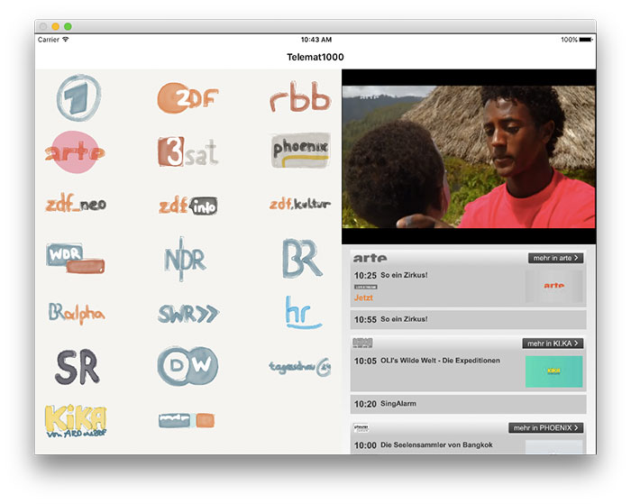

# Telemat1000_iPad
Telemat1000 ist eine einfache iPad-App, die den schnellen Zugriff auf das 24/7 Live-Streaming-Angebot der deutschen Öffentlich-Rechtlichen ermöglicht. 

Eigentlich sollte Telemat1000 als nicht-kommerzielle, kostenlose und werbefreie Anwendung im App Store veröffentlicht werden – auf Nachfrage waren die Sender jedoch entweder nicht zu erreichen, oder entschieden sich, freundlich aber bestimmt, gegen eine Freigabe für den Download über Apples App Store. Die Hintergründe lassen sich [hier nachlesen](http://www.iphone-ticker.de/sender-sagen-nein-keine-kostenlose-fernseh-app-fuer-euch-90140/). 

Telemat1000 wurde mit dem App-Baukasten [Composé](http://www.iphone-ticker.de/compos-app-baukasten-mit-eigenen-erweiterungen-87903/) zusammengeklickt. Die Composé-Projekt-Datei ist Teil dieses Repositories.

## Video-Demo

[Youtube-Link](http://www.youtube.com/watch?v=_oQRx7CDY3A)